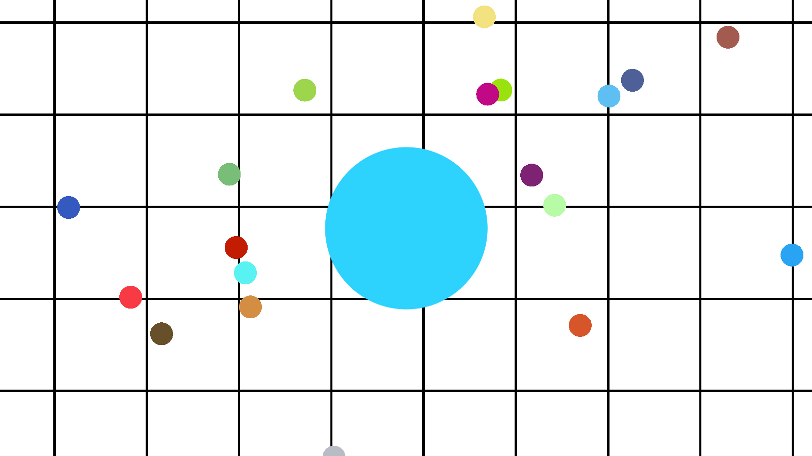

# Unity-Agario-Clone
A simple recreation of the video game agar.io using the Unity Engine.

# Introduction
I created this project around May 2018 when I was learning how to use the Unity Engine. It was created in preparation for my other game, Ball Guide, which was created shortly after.

In this game, the player can take control of a ball like object using the mouse, and grows in size upon collecting numerous miniature balls found around the map.

# Installation
After cloning this repository locally, open the project in the Unity Engine. Open up "main_scene.unity" in the "Assets/Scenes" directory, and the project should be set up.
